#### These procedure steps will be followed on the simulator

1. Select the type of concrete for mix design then click arrow mark in the bottom right corner to proceed. 
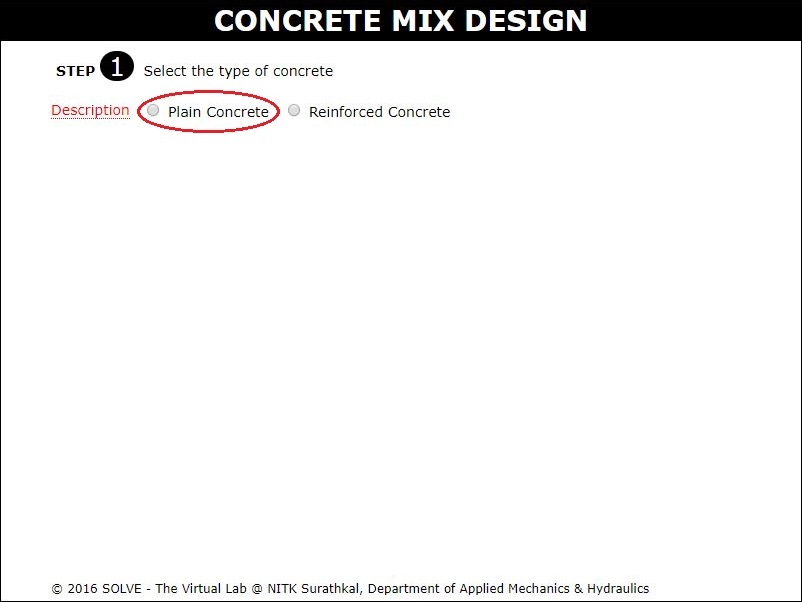 

2. Select the stipulations for mix design, and then click NEXT button.  
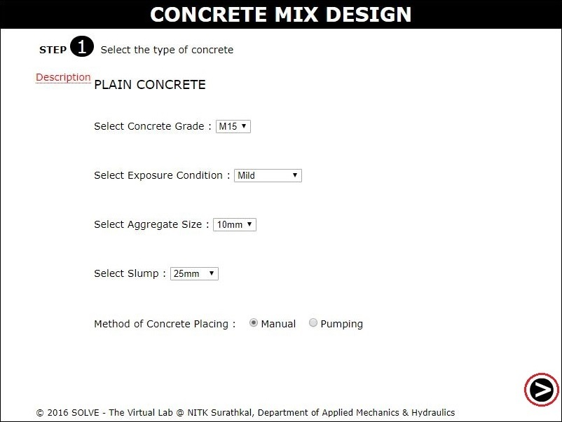 

3. Here to calculate the target strength of the mix select standard deviation from the table and enter in a given box. 
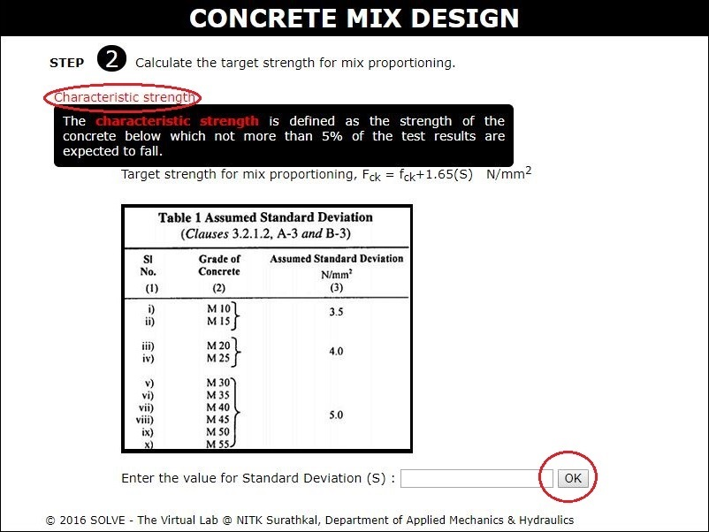 

4. Then in this step enter the suitable water cement ratio then click NEXT. 
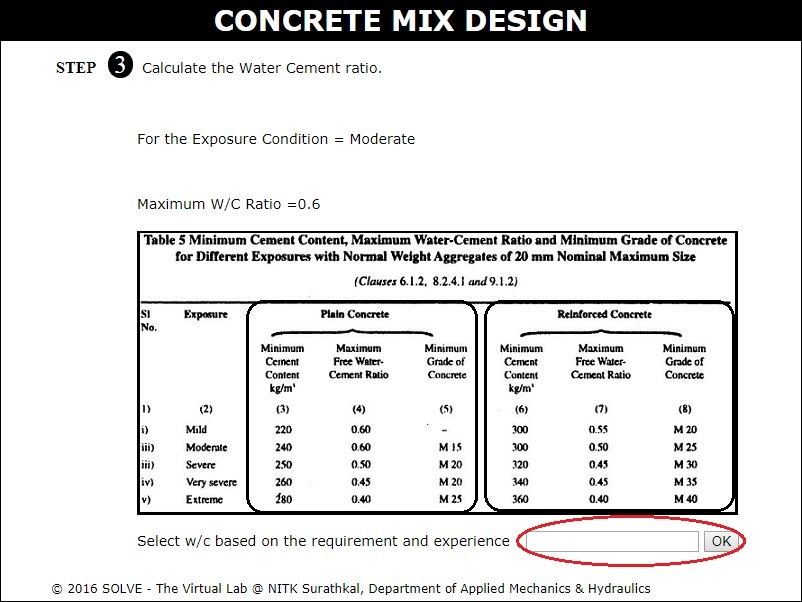 

5. Here the entered value and the maximum water cement ratio will be compared and if entered is less than the maximum value then proceed to the NEXT step or else start from the beginning. 
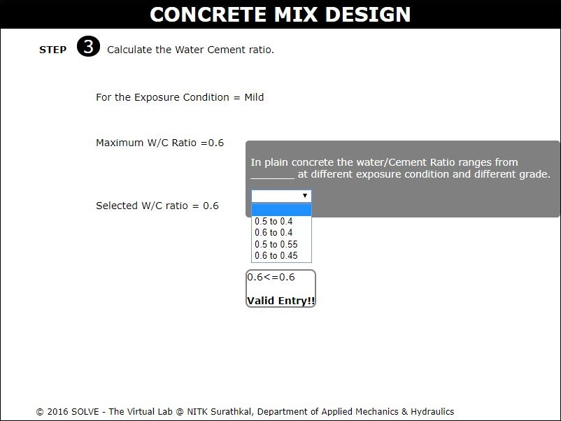 

6. Select the water content for the selected nominal size of the aggregate, click NEXT button. 
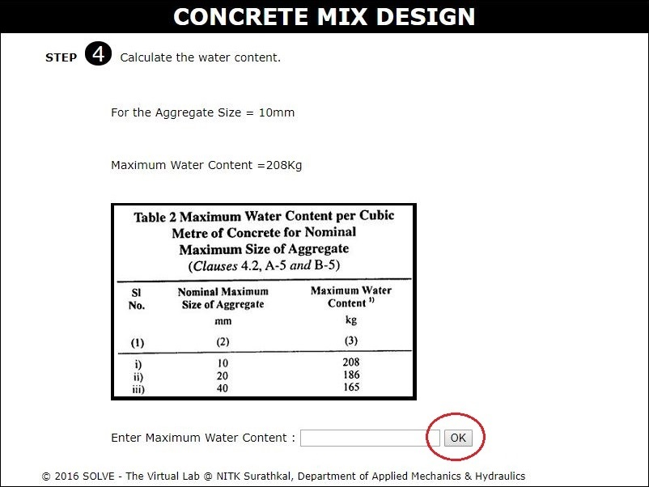 

7. Here check the water content selected based on the slump value, then the water content can be reduced by using super plasticizers, to reduce enter value between 0-29%( Note: 0% indicates no super plasticizers are used).  
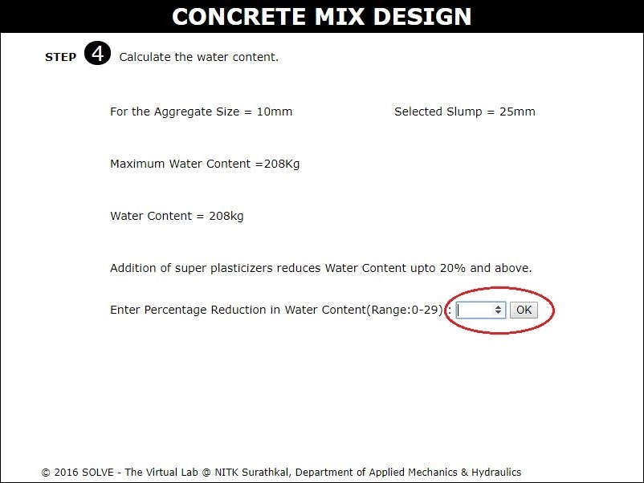 

8. Check the final selected water content with the minimum water content required for that exposure condition, click NEXT. 
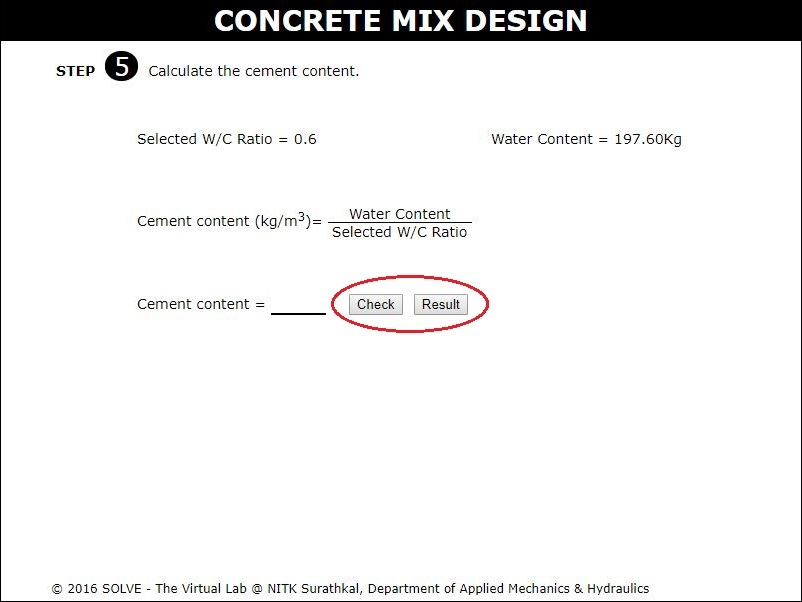 

9. For the selected water cement ratio the volume of coarse and fine aggregates is calculated. 
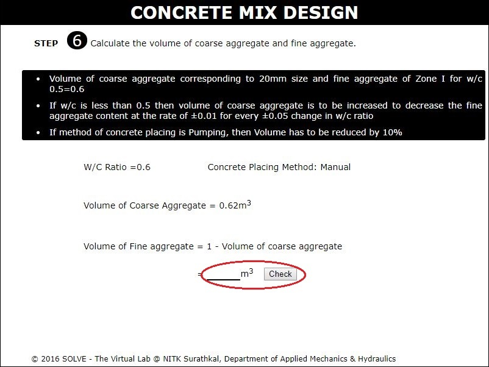 

10. The volume of all the concrete mix materials is calculated, then click on NEXT button to view the mix proportions. 
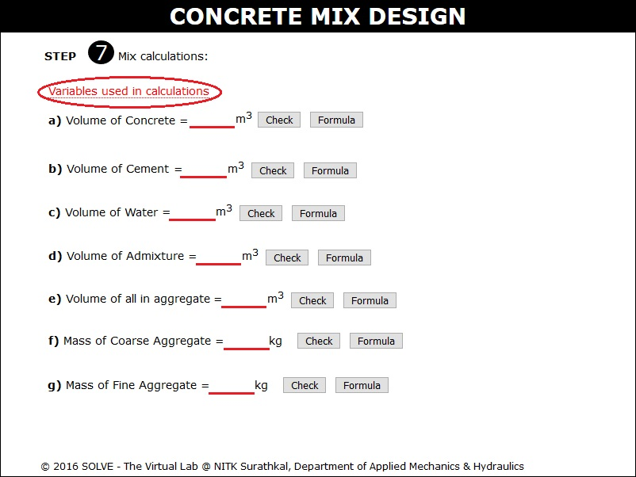 

11. Here the final mix proportion is obtained. 
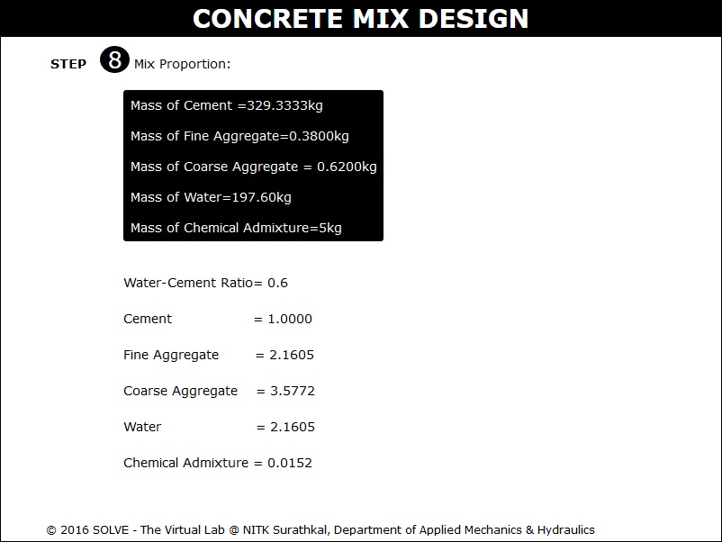 
