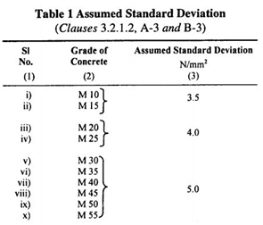

### INTRODUCTION 

The process of selecting suitable ingredients of concrete and determining their relative amounts with the objective of producing a concrete of the required, strength, durability, and workability as economically as possible is termed the concrete mix design. The proportioning of ingredient of concrete is governed by the required performance of concrete in plastic state and hardened state. The compressive strength of hardened concrete which is generally considered to be an index of its other properties depends upon many factors like quality and quantity of cement, water and aggregates, batching and mixing, placing, compaction and curing. The rich mixes may lead to high shrinkage and cracking in the structural concrete and to evolution of high heat of hydration in mass concrete which may cause cracking, hence the aim of the mix design is to produce a lean mix as possible.

There are different types of mixes.

#### 1. Nominal mix:
 
In the past the specifications for concrete prescribed the proportions of cement, fine and coarse aggregates. These mixes of fixed cement-aggregate ratio which ensures adequate strength are termed nominal mixes.

#### 2. Standard mix:

The nominal mixes of fixed cement-aggregate ratio (by volume) vary widely in strength and may result in under- or over-rich mixes. For this reason, the minimum compressive strength has been included in many specifications. These mixes are termed standard mixes. 

#### 3. Design mix:

In these mixes the performance of the concrete is specified by the designer but the mix proportions are determined by the producer of concrete, except that the minimum cement content can be laid down. This is most rational approach to the selection of mix proportions with specific materials in mind possessing more or less unique characteristics. 

1. 
According to IS: 456–2000 and IS: 1343–‘80, the characteristic strength is defined as that value 50 below which not more than 5 per cent results are expected to fall, in which case the Target mean strength for mix design.

  Target mean strength:
  

  Where, fck= Characteristic compressive strength at 28 days and S = Standard deviation 

  
</img>

2. 
Selection of Water / Content Ratio: Consider from the specified table (Table-5) of IS: 456 for desired exposure condition as preliminary w/c ratio that has to be further checked for limiting value ensuring durability.

</img>
 

3. 
Calculation of Water Content: IS: 10262-2009 allows use of water reducers/ super plasticizers and also specifies the alteration in water content accordingly. Further water adjustment was specified in terms slump variation (+3% for every 25mm slump over 50mm).

</img> 

 

4. 
Calculation of Cement Content: The cement content per unit volume of concrete may be calculated from free water-cement ratio and the quantity of water per unit volume of concrete.

 

5. 
Calculation of Coarse Aggregate Proportion: For the desired workability, the quantity of mixing water per unit volume of concrete and the ratio of coarse aggregate to total aggregate by absolute volume are to be estimated from Table 3.
From Table 3, volume of coarse aggregate corresponding to 20mm size aggregate and fine aggregate (Zone I) for water-cement ratio of 0.50 =0.60.
For every ±0.05 change in w/c, the coarse aggregate proportion is to be changed by 0.01. If the w/c is less than 0.5 (standard value), volume of coarse aggregate is required to be increased to reduce the fine aggregate content. If the w/c is more than 0.5, volume of coarse aggregate is to be reduced to increase the fine aggregate content. If coarse aggregate is not angular, volume of coarse aggregate may be required to be increased suitably, based on experience.

6. 
Calculation of Aggregate Content: Aggregate content can be determined from the following equations,

 

 

Where,

V = Absolute volume of fresh concrete, which is equal to gross volume (m3) – volume of entrapped air.

W= Mass of water (kg) per m3 of concrete

C= Mass of cement (kg) per m3 of concrete

Sc=Specific Gravity of cement

P= Ratio of coarse aggregate to total aggregate by total volume

fa,Ca= Total mass of fine and coarse aggregate per m3 of concrete respectively

Sfa , Sca Specific Gravities of saturated, surface dry fine aggregate and coarse aggregates

#### Relevant Indian standard:
1. IS:456-2000: Plain and Reinforced Concrete Code of Practice, 4th Revision, 2000.
2. IS:10262-2009: Concrete Mix Proportioning Guidelines, First Revision, 2009.
 
